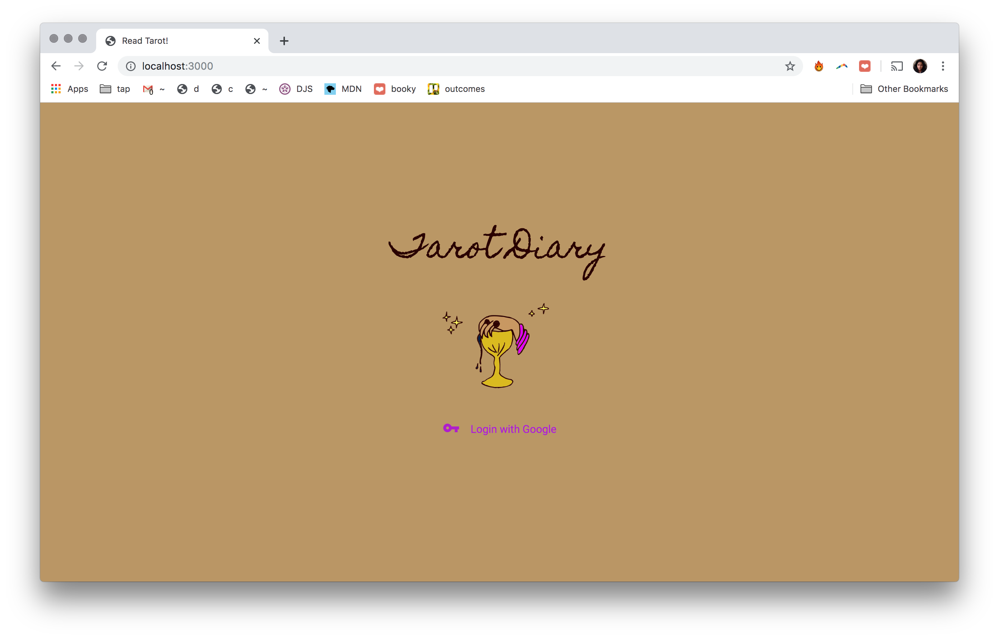

## [**Tarot Diary**](http://readtarot.herokuapp.com)

###  **Contents**
1. [Description](#desc)
2. [Getting Started](#start)
3. [User Experience](#ui) 
4. [Tech](#tech)
5. [Stretch Goals](#stretch)

##  **Description**
________________

Tarot is more than a fortune-telling oracle - it is a means to self-knowledge and wisdom. Today, anyone can learn its 78-card system. Tarot Diary offers users the opportunity to perform one-card readings and build their own diary of card meanings.

[top](#home)

##  **Getting Started**
________________

[Tarot Diary](http://readtarot.herokuapp.com)

Click the link above to begin! Sign in with your Google profile to start pulling cards and writing card meanings.

[top](#home)

##  **User Experience**
________________

**Landing**

**User Login**

**Pull A Card**

**View All Cards**

**Edit Individual Card Meanings**

**View Card Meanings and Add Diary Entries**

**Option to Delete Diary Entry**

[top](#home)

##  **Tech**
________________

* [Ekelen's Tarot API](https://github.com/ekelen/tarot-api)
* Passport for user authentication via Google
* Google API Library
* Mongoose & MongoDB Atlas Cluster
* EJS / HTML / Materialize CSS / Javascript
* Node.js & Express

[top](#home)

##  **Stretch Goals**
________________

* Continue styling the app
* In the update function, allow users to use placeholder text to edit their card meanings
* Users can edit comments to their personal readings
* Users can query their own databases
* Create a Card schema + cross-user database that allows users to share their card meanings
* Add images to the card meanings
* Users can do 3-card readings

[top](#home)